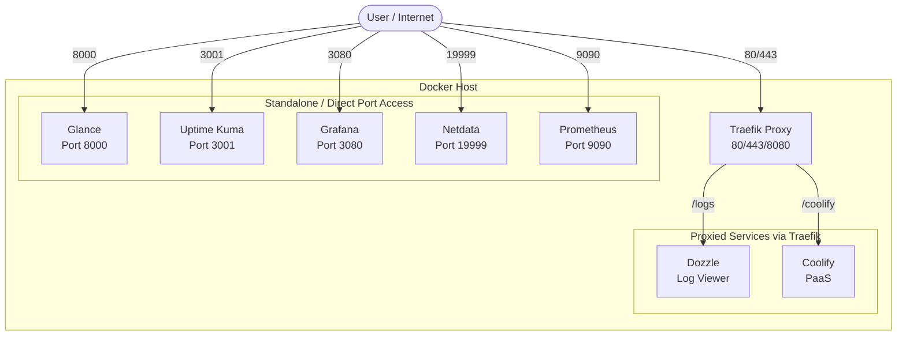

# 🧪 Homelab

- This repository contains the configuration and documentation for my home lab setup, 
featuring various monitoring and visualization services running on Docker containers.

## 🏗️ Architecture



## 📦 Services

### 1. Glance Dashboard

A web-based dashboard providing an overview of your home lab environment.

- **Port**: 8000 (Standalone) / `https://api-homelab.jeerasakananta.dev/` (Unified)
- **Features**: Service status monitoring, Docker container widget
- **Location**: [glance/](glance/)

### 2. Grafana

Open-source analytics and interactive visualization platform.

- **Port**: 3080
- **Features**: Data visualization, dashboards, alerting
- **Location**: [grafana/](grafana/)

### 3. Netdata

Real-time performance and health monitoring.

- **Port**: Uses host network mode (19999)
- **Features**: System metrics, container monitoring, performance insights
- **Location**: [netdata/](netdata/)

### 4. Prometheus

Monitoring system and time-series database.

- **Port**: 9090
- **Features**: Metrics collection, alerting, powerful query language
- **Location**: [prometheus/](prometheus/)

### 5. Uptime Kuma

A self-hosted monitoring tool like "Uptime Robot".

- **URL**: `https://api-homelab.jeerasakananta.dev/kuma`
- **Location**: [kuma/](kuma/)

### 6. Dozzle

Real-time log viewer for Docker containers.

- **URL**: `https://api-homelab.jeerasakananta.dev/logs`

### 7. Coolify

An open-source & self-hostable Heroku / Netlify / Vercel alternative.

- **URL**: `https://api-homelab.jeerasakananta.dev/coolify`

## 🔌 Ports Overview

| Service           | Port (Standalone)     | Traefik Route |
|-------------------|--------------------   |---------------|
| Glance Dashboard  | 8000                  | `/`           |
| Grafana           | 3080                  | -             |
| Netdata           | 19999                 | -             |
| Prometheus        | 9090                  | -             |
| Uptime Kuma       | -                     | `/kuma`       |
| Dozzle            | -                     | `/logs`       |
| Coolify           | -                     | `/coolify`    |


## 🔧 Requirements

- Docker
- Docker Compose
- cloudflared Tunnel

## 🚀 Setup

1. Clone the repository:

   ```bash
   git clone https://github.com/JeerasakAnanta/homelab.git
   cd homelab
   ```

2. **Unified Setup (Recommended)**:
   
   Ensure the `homelab` external network and Traefik are running.
   
   ```bash
   docker-compose -f docker-compose.homelab.yml up -d
   ```

3. **Standalone Services**:
   
   Start individual services using their respective directories:

   ```bash
   # Glance Dashboard
   cd glance && docker-compose up -d
   
   # Grafana
   cd grafana && docker-compose up -d
   
   # Netdata
   cd netdata && docker-compose up -d
   
   # Prometheus
   cd prometheus && docker-compose -f docker-compose.yaml up -d
   ```

## ⚙️ Configuration

Each service has its own configuration directory:

- **Glance**: `glance/config/` - Contains dashboard configuration files
- **Grafana**: Environment variables in docker-compose.yml
- **Netdata**: `netdata/netdataconfig/`
- **Prometheus**: `prometheus/prometheus.yml`

## 📝 Notes

- Ensure all required ports are available before starting the services
- Some services may require additional environment variables (check respective docker-compose files)
- Netdata runs in host network mode for comprehensive system monitoring