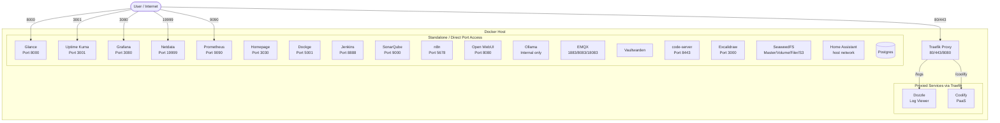

# 🧪 Homelab

- This repository contains the configuration and documentation for my home lab setup,
featuring monitoring, visualization, automation, CI/CD, storage, and developer-tooling services running on Docker containers.

## 🏗️ Architecture


```mermaid
graph TD
    User([User / Internet])

    subgraph Host [Docker Host]
        Traefik[Traefik Proxy<br/>80/443/8080]

        subgraph Proxied [Proxied Services via Traefik]
            Dozzle[Dozzle<br/>Log Viewer]
            Coolify[Coolify<br/>PaaS]
        end

        subgraph Standalone [Standalone / Direct Port Access]
            Glance[Glance<br/>Port 8000]
            Kuma[Uptime Kuma<br/>Port 3001]
            Grafana[Grafana<br/>Port 3080]
            Netdata[Netdata<br/>Port 19999]
            Prometheus[Prometheus<br/>Port 9090]
            Homepage[Homepage<br/>Port 3030]
            Dockge[Dockge<br/>Port 5001]
            Jenkins[Jenkins<br/>Port 8888]
            SonarQube[SonarQube<br/>Port 9000]
            n8n[n8n<br/>Port 5678]
            OpenWebUI[Open WebUI<br/>Port 8080]
            Ollama[Ollama<br/>Internal only]
            EMQX[EMQX<br/>1883/8083/18083]
            Vaultwarden[Vaultwarden]
            VSCodeServer[code-server<br/>Port 8443]
            Excalidraw[Excalidraw<br/>Port 3000]
            SeaweedFS[SeaweedFS<br/>Master/Volume/Filer/S3]
            HomeAssistant[Home Assistant<br/>host network]
            Postgres[(Postgres)]
        end
    end

    User -->|80/443| Traefik
    User -->|8000| Glance
    User -->|3001| Kuma
    User -->|3080| Grafana
    User -->|19999| Netdata
    User -->|9090| Prometheus

    Traefik -->|/logs| Dozzle
    Traefik -->|/coolify| Coolify
```

## 📦 Services

### Monitoring & Observability

#### 1. Glance Dashboard

A web-based dashboard providing an overview of your home lab environment.

- **Port**: 8000 (Standalone) / `https://api-homelab.jeerasakananta.dev/` (Unified)
- **Features**: Service status monitoring, Docker container widget
- **Location**: [glance/](glance/)

#### 2. Grafana

Open-source analytics and interactive visualization platform.

- **Port**: 3080
- **Features**: Data visualization, dashboards, alerting
- **Location**: [grafana/](grafana/)

#### 3. Netdata

Real-time performance and health monitoring.

- **Port**: Uses host network mode (19999)
- **Features**: System metrics, container monitoring, performance insights
- **Location**: [netdata/](netdata/)

#### 4. Prometheus

Monitoring system and time-series database.

- **Port**: 9090
- **Features**: Metrics collection, alerting, powerful query language
- **Location**: [prometheus/](prometheus/)

#### 5. Uptime Kuma

A self-hosted monitoring tool like "Uptime Robot".

- **URL**: `https://api-homelab.jeerasakananta.dev/kuma`
- **Location**: [kuma/](kuma/)

#### 6. Dozzle

Real-time log viewer for Docker containers.

- **URL**: `https://api-homelab.jeerasakananta.dev/logs`
- **Port**: 127.0.0.1:8080 (localhost only, put behind a reverse proxy)
- **Location**: [dozzle/](dozzle/)

#### 7. Homepage

A modern, self-hosted dashboard/start page for all services.

- **Port**: 3030
- **Location**: [homepage/](homepage/)

### Platform & CI/CD

#### 8. Coolify

An open-source & self-hostable Heroku / Netlify / Vercel alternative.

- **URL**: `https://api-homelab.jeerasakananta.dev/coolify`
- **Location**: [coolify/](coolify/)

#### 9. Dockge

A fancy, easy-to-use Docker Compose stack manager.

- **Port**: 5001
- **Location**: [dockge/](dockge/)

#### 10. Jenkins

Automation server for CI/CD pipelines.

- **Port**: 8888 (UI), 50000 (agent connections)
- **Location**: [jenkins/](jenkins/)

#### 11. SonarQube

Static code analysis platform for code quality and security scanning.

- **Port**: 127.0.0.1:9000 (localhost only)
- **Location**: [sonarqube/](sonarqube/)

### Automation & AI

#### 12. n8n

Workflow automation tool.

- **URL**: `https://n8n.jeerasakananta.dev`
- **Port**: 5678
- **Location**: [n8n/](n8n/)

#### 13. Ollama

Local LLM runtime.

- **Port**: Internal only (127.0.0.1:11434, disabled by default in compose)
- **Location**: [ollama/](ollama/)

#### 14. Open WebUI

Web UI for interacting with local LLMs (e.g. via Ollama).

- **Port**: 8080
- **Location**: [openwebui/](openwebui/)

#### 15. EMQX

MQTT broker for IoT and messaging.

- **Ports**: 1883 (MQTT), 8883 (MQTT SSL), 8083 (MQTT WS), 8084 (MQTT WSS), 18083 (Dashboard UI)
- **Location**: [emqx/](emqx/)

#### 16. Home Assistant

Home automation platform.

- **Network**: Host network mode
- **Location**: [homeassistant/](homeassistant/)

### Storage & Data

#### 17. SeaweedFS

Distributed object/file storage system with S3-compatible API.

- **Master**: `${MASTER_PORT}` (default 9333) — cluster status & topology
- **Volume**: `${VOLUME_PORT}` (default 8080) — internal, rarely accessed directly
- **Filer**: `${FILER_PORT}` (default 8888) — web file browser
- **S3 API**: `${S3_PORT}` (default 8333) — S3-compatible clients (aws-cli, rclone, SDKs)
- **Location**: [seaweedFS/](seaweedFS/) (see [seaweedFS/readme.md](seaweedFS/readme.md) for usage examples)

#### 18. Postgres

Shared PostgreSQL database instance.

- **Port**: `${DB_PORT}` (configured via `.env`)
- **Location**: [postgres/](postgres/)

### Developer Tools

#### 19. code-server (VS Code Server)

Browser-based VS Code development environment.

- **Port**: 8443
- **Location**: [vscodeserver/](vscodeserver/)

#### 20. Excalidraw

Self-hosted virtual whiteboard for sketching diagrams.

- **Port**: 3000
- **Location**: [excalidraw/](excalidraw/)

### Security

#### 21. Vaultwarden

Lightweight, self-hosted Bitwarden-compatible password manager server.

- **Ports**: `${APP_PORT}` (web), `${WEBSOCKET_PORT}` (live sync)
- **Location**: [vaultwarden/](vaultwarden/)

## 🔌 Ports Overview

| Service           | Port (Standalone)          | Traefik Route |
|--------------------|----------------------------|---------------|
| Glance Dashboard   | 8000                       | `/`           |
| Grafana            | 3080                       | -             |
| Netdata            | 19999                      | -             |
| Prometheus         | 9090                       | -             |
| Uptime Kuma        | -                           | `/kuma`       |
| Dozzle             | 127.0.0.1:8080              | `/logs`       |
| Homepage           | 3030                        | -             |
| Coolify            | -                           | `/coolify`    |
| Dockge             | 5001                        | -             |
| Jenkins            | 8888 / 50000                | -             |
| SonarQube          | 127.0.0.1:9000              | -             |
| n8n                | 5678                        | -             |
| Ollama             | internal (disabled)         | -             |
| Open WebUI         | 8080                        | -             |
| EMQX               | 1883 / 8083 / 8883 / 8084 / 18083 | -       |
| Home Assistant     | host network                | -             |
| SeaweedFS Master   | 9333 (via `.env`)           | -             |
| SeaweedFS Volume   | 8080 (via `.env`)           | -             |
| SeaweedFS Filer    | 8888 (via `.env`)           | -             |
| SeaweedFS S3       | 8333 (via `.env`)           | -             |
| Postgres           | via `.env` (`DB_PORT`)      | -             |
| code-server        | 8443                        | -             |
| Excalidraw         | 3000                        | -             |
| Vaultwarden        | via `.env`                  | -             |

> Note: Some services (n8n, Open WebUI, Jenkins internal) use overlapping default ports (e.g. 8080). Check each `docker-compose.yaml` before running services simultaneously on the same host network.

## 🔧 Requirements

- Docker
- Docker Compose
- cloudflared Tunnel

## 🚀 Setup

1. Clone the repository:

   ```bash
   git clone https://github.com/JeerasakAnanta/homelab.git
   cd homelab
   ```

2. **Unified Setup (Recommended)**:

   Ensure the `homelab` external network and Traefik are running.

   ```bash
   docker-compose -f docker-compose.homelab.yml up -d
   ```

3. **Standalone Services**:

   Start individual services using their respective directories, e.g.:

   ```bash
   # Glance Dashboard
   cd glance && docker-compose up -d

   # Grafana
   cd grafana && docker-compose up -d

   # Netdata
   cd netdata && docker-compose up -d

   # Prometheus
   cd prometheus && docker-compose -f docker-compose.yaml up -d

   # SeaweedFS (copy .env.example to .env first)
   cd seaweedFS && docker-compose up -d
   ```

   Most other services (dockge, emqx, excalidraw, homeassistant, homepage, jenkins, n8n, ollama, openwebui, postgres, sonarqube, vaultwarden, vscodeserver) follow the same pattern — `cd <service> && docker-compose up -d` (or `docker compose -f compose.yaml up -d` where the file is named `compose.yaml`).

## ⚙️ Configuration

Each service has its own configuration directory:

- **Glance**: `glance/config/` - Contains dashboard configuration files
- **Grafana**: Environment variables in docker-compose.yml
- **Netdata**: `netdata/netdataconfig/`
- **Prometheus**: `prometheus/prometheus.yml`
- **SeaweedFS**: `seaweedFS/.env` (copy from `.env.example`) and `seaweedFS/s3.json` for S3 credentials
- **Postgres**: `postgres/.env`
- **n8n**: `n8n/.env` (copy from `.env.example`)
- **SonarQube**: `sonarqube/.env` (copy from `.env.example`)
- **Vaultwarden**: environment variables (`DOMAIN`, `APP_PORT`, `WEBSOCKET_PORT`, `ADMIN_TOKEN`, etc.)
- **code-server**: environment variables (`PUID`, `PGID`, `TZ`, `CODE_SERVER_PASSWORD`)

## 📝 Notes

- Ensure all required ports are available before starting the services
- Some services may require additional environment variables (check respective docker-compose files)
- Netdata and Home Assistant run in host network mode
- Sensitive files (`.env`, credentials, `s3.json` secrets, TLS keys) are excluded via `.gitignore` — always copy from the corresponding `.env.example` before starting a service
